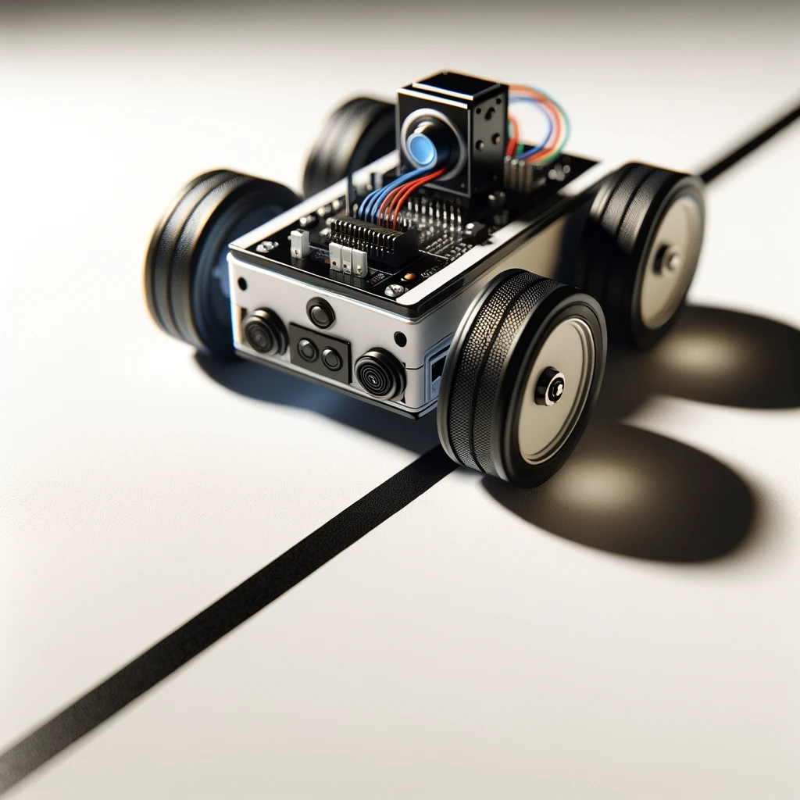
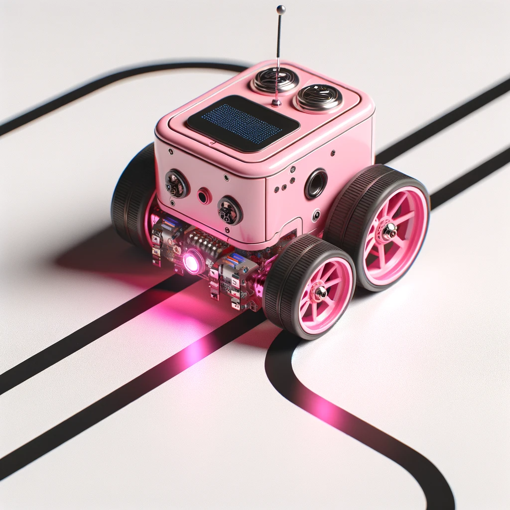
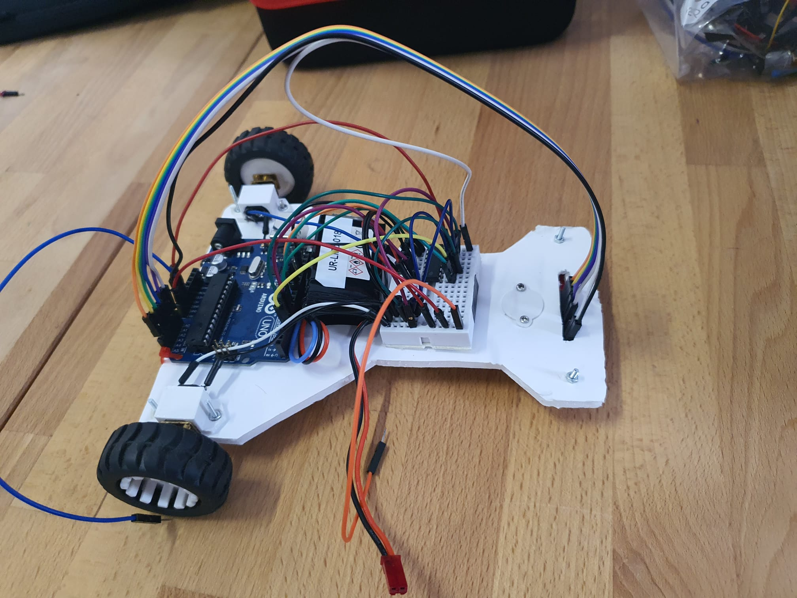
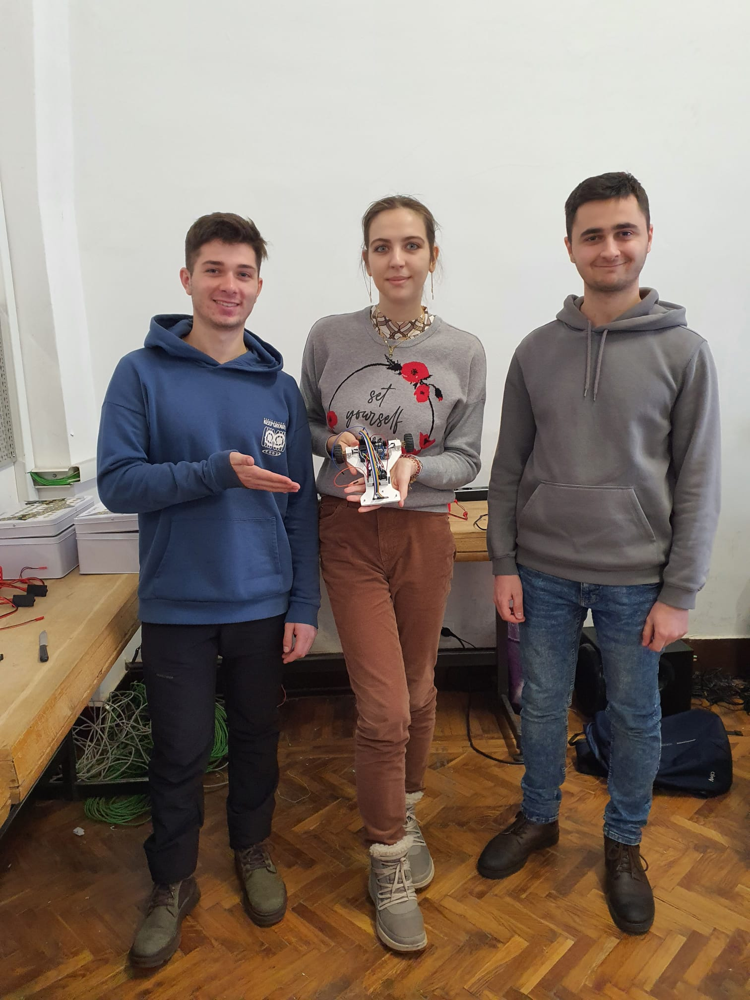
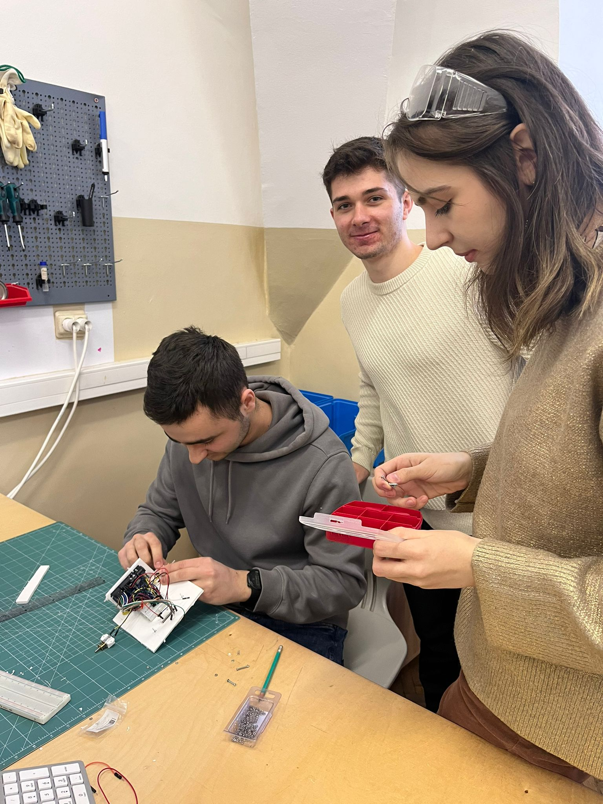

# Proiect Line Follower: Performanță și Inovație

## Descriere
Acest proiect prezintă crearea unui robot line follower, care combină ingeniozitatea ingineriei cu precizia programării. Scopul a fost de a dezvolta un robot capabil să urmeze linii cu eficiență și precizie, demonstrând astfel potențialul tehnologiilor autonome.

### Componente Principale:
- **Arduino Uno**: Creierul robotului, coordonează toate componentele.
- **2 Motoare**: Asigură mișcarea și manevrabilitatea robotului.
- **Senzor Infraroșu**: Detectează linia și ajută la navigare.
- **Baterie LiPo**: Oferă o alimentare fiabilă și eficientă.
- **Placă Personalizată**: Utilizată pentru structura robotului, echilibrând rezistența și greutatea.
- **Shift Register**: Extinde capabilitățile digitale ale Arduino Uno.
- **Sistem PID**: Folosind doar ajustările pentru KP (Proportional) și KD (Derivative).

### Caracteristici Unice:
- **Calibrare Automată**: Permite robotului să se adapteze la diferite condiții de iluminare și texturi ale suprafeței.
- **Traseu Complex**: Robotul a demonstrat abilitatea de a naviga un traseu dificil, finalizându-l în aproximativ 18.5 secunde.

## Implementare
Implementarea acestui proiect a implicat un echilibru între hardware robust și software adaptabil. Fiecare componentă a fost selectată și integrată cu scopul de a optimiza performanța și fiabilitatea.

### Sistemul PID
Acest sistem a fost esențial pentru controlul precis al mișcării robotului. Concentrându-ne pe KP și KD, am reușit să obținem un răspuns rapid și precis, crucial pentru navigarea traseului complex.

### Calibrare Automată
Sistemul de calibrare automată a fost o inovație cheie, permițând robotului să opereze eficient în condiții variate, fără intervenția manuală.

## Viziunea echipei
### Cum își imaginează băieții că va arăta proiectul:

### Cum își imaginează fetele că va arăta proiectul:

### Cum a arătat de fapt:

## Demonstratie Video
Pentru o demonstrație video a robotului nostru line follower, vizitați linkul nostru de YouTube: [Demo Line Follower](https://youtu.be/7I6eCeHwWuQ)

## Echipa
 
## Concluzii
Proiectul nostru demonstrează nu doar abilitățile tehnice necesare pentru construirea unui robot line follower eficient, dar și inovația în gândirea de design și programare. Este un exemplu clar al potențialului roboticii autonome și al aplicabilității sale în diferite domenii.
